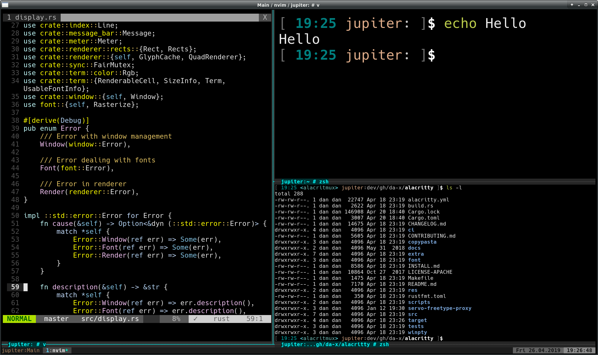

# Tmux Pane Font Resize

This repository contains a jointly patched combination of [Alacritty](https://github.com/jwilm/alacritty) and [tmux](https://github.com/tmux/tmux) to support scaling fonts of specific tmux panes.

Here's a screenshot of it in action:



The implementation works, however it's in an experimental development stage.

## Obtaining this source

Using Git:

`git clone --recurse-submodules https://github.com/da-x/alacritmux`

## Building and testing

Building and testing can be done in isolation from installed Alacritty and Tmux binaries.

### Build

We should build both patched programs. Please see each program's build instruction for
more detail.

```sh
cd alacritty
cargo build --release
# Or `cargo build` for a dev build
cd ..

cd tmux
./configure
cd ..
```

### Run

```sh
# Cleanup a previous session first (useful if we rebuilt tmux)
./tmux/tmux -L alacritmux kill-server

# Start a new session
alacritty/target/release/alacritty -e ./tmux/tmux -L alacritmux

# Or, if you built the dev version of Alacritty:
# alacritty/target/debug/alacritty -e ./tmux/tmux -L alacritmux
```

### Use

Enjoy font resize in a tmux pane using:

 * <kbd>shift</kbd> + <kbd>ctrl</kbd> + <kbd>keypad +</kbd>
 * <kbd>shift</kbd> + <kbd>ctrl</kbd> + <kbd>keypad -</kbd>

## Contributions

Any contributions are welcome.
